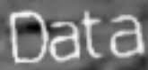
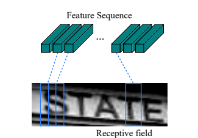

## WEEK 1 REPORT (2018-06-10) 
### 1. Report detail:
+ Text recognition pipeline using Deep Neural Network
+ Attention-OCR

### 2. Text recognition pipeline:
#### 2.1 Problem statement:
+ Given the image with text like image below as input:

+ Output the correct text: "data"

#### 2.2 Solution Overview:
+ Using CNN to convert input image into a sequence of features.
+ From the sequence of features output the correct text.

+ The idea of using CNN is to slide the high-dimensional input image into a sequence of column of lower-dimensional features.

 

+ After that, this sequence is used as input into RNN layer to output the corresponding prediction of probability over a set of characters.

+ Lastly, a decoding algorithm is applied to transform the prediction probability into target character and then concatenate to output the correspodning text.

+ There are 2 types of loss function can be used depend on the architeture of the DNN: *_CTC loss_* with CRNN and *_cross-entropy_* with seq2seq.

### 3. Attention-OCR:
We consider the text recognition problem as a sequence-to-sequence problem in which:
+ Input sequence: sequence of features from CNN.
+ Output sequence: sequence of text.  

Therefore we will use Attention-OCR [[github-link]](https://github.com/da03/Attention-OCR) as the baseline model.  

#### 3.1 Seq2seq Overview:
Seq2seq model relies on the encoder-decoder paradigm. The encoder encodes the input sequence into a representation and then the decoder will output the target sequence from that represenation.  
 *Encoder*
 *Decoder*

#### 3.2 Seq2seq with Attention:
In seq2seq model, the decoder must use only the final hidden state of the RNN to decode all the target sequence. Therefore, in order to give the decoder an easier job, attention mechanism can be used. With attention, the decoder has access to all the hidden state of the encoder RNN at every time step and it can use all that information to predict the target sequence.
 *Attention Mechanism*

#### 4. Next Week Work:
1. Read and understand the Attention-OCR code.
2. Training the model with the Synth 90K dataset and other datasets.

#### 5. Questions:
1. What is the new idea in using attention with seq2seq in our group's approach? And what problem it will solve?
2. What kind of result we need to achieve in order to consider the research is successful?

#### Answers:
1. Ideal 1: The global attention take all sequence as input. We can give a efficient scope for attention.
   Ideal 2: We can integrate language model to decoder to make better recognition system.
2. Achive the state of art in the field scene text recognition on the standard database.
  
